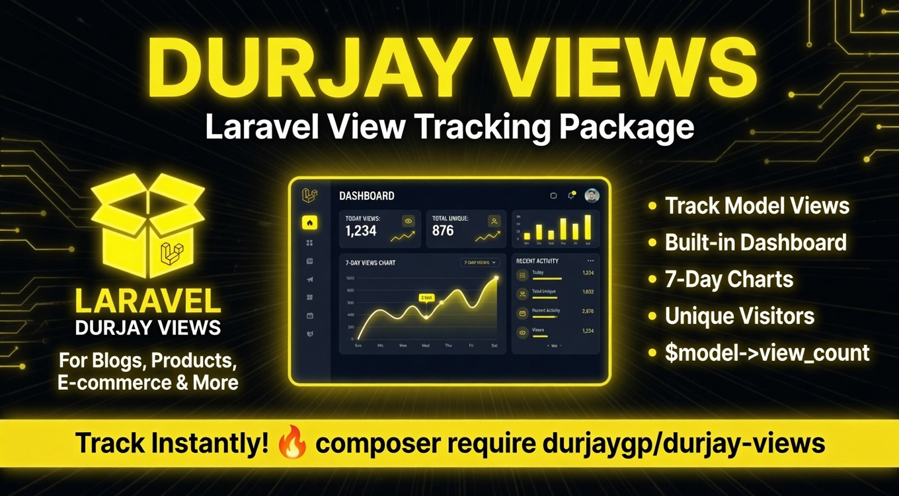
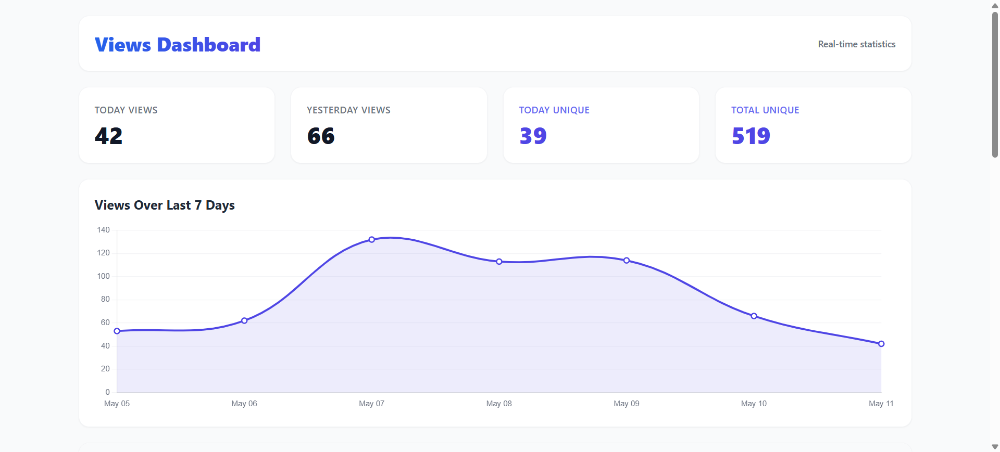

# Durjay Views



A simple view counter for Laravel. Track views for Blogs, Products, Services, and more in a single table using a helper function or a trait. It also includes an awesome Tailwind-designed dashboard for statistics.

## Installation

You can install the package via composer:

```bash
composer require durjaygp/durjay-views
```

## Setup

1. Publish the migration and views (optional):
```bash
php artisan vendor:publish --provider="Durjaygp\DurjayViews\DurjayViewsServiceProvider"
```

2. Run the migrations:
```bash
php artisan migrate
```

## Usage

### Using the Helper Function

You can easily track views for any entity using the provided global helper function:

```php
// Parameters: string $type, int $typeId
trackDurjayViews('product', $product->id);
trackDurjayViews('blog', $blog->id);
```

### Using the Trait

Alternatively, you can add the `Viewable` trait to your models:

```php
namespace App\Models;

use Illuminate\Database\Eloquent\Model;
use Durjaygp\DurjayViews\Traits\Viewable;

class Product extends Model {
    use Viewable;
}
```

Then you can record a view directly on the model instance:

```php
$product->recordDurjayView();
```

To get the total view count (sum of all `views` increments):

```php
echo $product->view_count;
```

## Dashboard Statistics

This package provides a beautifully crafted Tailwind CSS dashboard to visualize your application's views.



You can access the statistics dashboard at: `/durjay-views/stats`

The dashboard includes:
- View statistics for **Today** and **Yesterday**
- **Total Unique** and **Today Unique** Views metrics
- A gorgeous 7-day **Views Chart**
- A **Recent Views Activity** table (displays Type, User/Guest, Date, and Total Views)

You can publish the views to customize the design:
```bash
php artisan vendor:publish --provider="Durjaygp\DurjayViews\DurjayViewsServiceProvider" --tag="views"
```

## Admin Route (Protected Access)

By default the dashboard is accessible at `/durjay-views/stats`. If you want to protect it behind authentication or admin middleware, publish the config and set your preferred middleware:

```bash
php artisan vendor:publish --provider="Durjaygp\DurjayViews\DurjayViewsServiceProvider" --tag="config"
```

Then update `config/durjay-views.php`:

```php
return [
    /*
    |--------------------------------------------------------------------------
    | Dashboard Middleware
    |--------------------------------------------------------------------------
    | Middleware applied to the /durjay-views/stats route.
    | Use 'auth' to restrict to logged-in users, or 'auth,admin' for admins.
    |
    */
    'middleware' => ['web', 'auth'],
];
```

The route is registered automatically — no extra steps needed after changing the config.

## License

The MIT License (MIT). Please see [License File](LICENSE.md) for more information.
